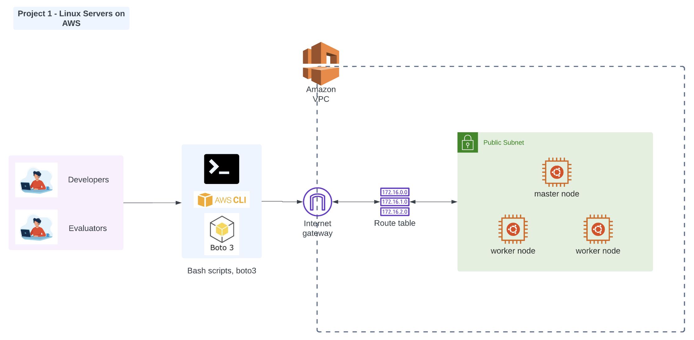

# Linux Servers on AWS - Lara Tunc

This project uses boto3 to create a vpc, an internet gateway, a route table, a public subnet with a master and 2 worker nodes on AWS in us-east-1.
Please do not forget to delete your resources after creation.

# Architectural diagram



## How to run

```sh
$ pip3 install -r requirements.txt
$ python3 main.py
```

# URL to public GitHub repo

https://github.com/LaraTunc/we-cloud-eval-1
